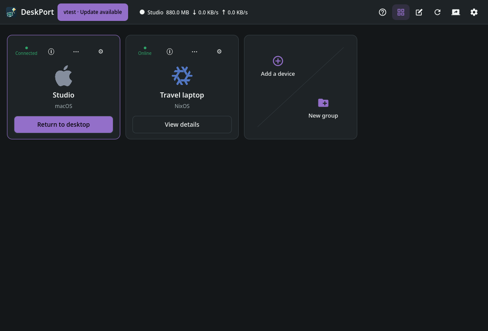
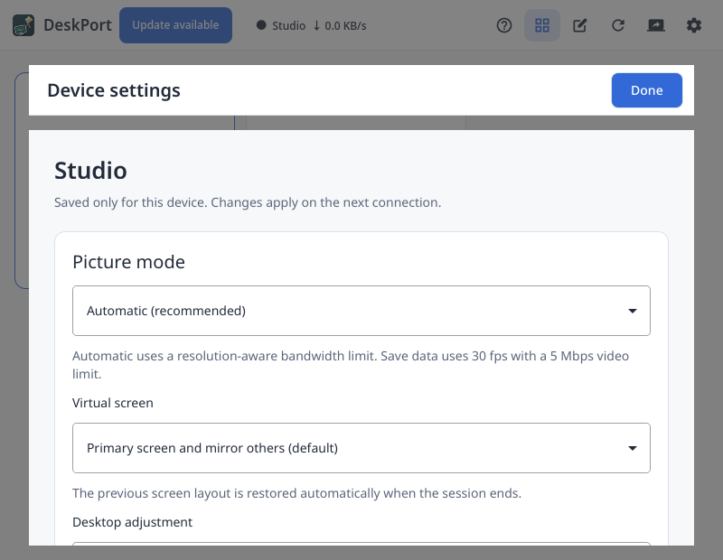
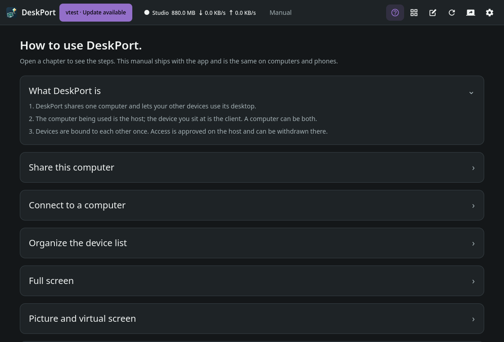

<p align="center">
  
</p>

<h1 align="center">DeskPort</h1>

<p align="center">
  <a href="../../README.md">English</a> ·
  <a href="README.zh-CN.md">简体中文</a> ·
  <a href="README.zh-TW.md">繁體中文</a> ·
  <b>日本語</b>
</p>

<p align="center">
  Moonlight と Sunshine を基盤にしたリモートデスクトップ・ワークスペース。<br>
  リモートデスクトップをバックグラウンドで待機させ、ワンアクションで今のワークスペースに呼び出し、
  再接続なしでしまえます。
</p>

<p align="center">
  <a href="https://github.com/keithxc/deskport/releases/tag/v0.6.0"></a>
  <a href="https://apps.apple.com/us/app/deskport/id6812389978"></a>
  <a href="../../LICENSE"></a>
</p>

---

## 画面プレビュー

デモ用デバイスを使った現在の画面です。画像をクリックすると拡大できます。ストア審査や正式リリースの完了を示すものではありません。

| デバイス | 設定 | マニュアル |
| --- | --- | --- |
| [](../media/devices.png) | [](../media/device-settings.png) | [](../media/manual.png) |

## 主な機能と製品比較

自動サイズ調整、デバイス別の微調整、確認付き接続引き継ぎ、バックグラウンドからの復帰、オンデマンドのクリップボード共有と、公式資料付きの比較表は[詳細説明](../../README.md#main-features)をご覧ください。確認日：2026-09-20。性能ベンチマークではありません。

## プラットフォーム状況

| プラットフォーム | 役割 | 進捗 | 入手 |
| --- | --- | --- | --- |
| **macOS**（Apple Silicon、macOS 26 以降） | ビューア + ホスト + 仮想ディスプレイ | ✅ 安定版 — 0.6.0、Apple 公証済み | [DMG](https://github.com/keithxc/deskport/releases/download/v0.6.0/DeskPort-0.6.0-macos-arm64.dmg) |
| **Linux x86-64** | ビューア + ホスト | ✅ 公開済み — 0.6.0：Nix / DEB / RPM / Arch / AppImage、Flatpak はクライアント専用 | [リリース](https://github.com/keithxc/deskport/releases) · [ガイド](../LINUX_PACKAGES.md) |
| **Linux ARM64** | ビューア + ホスト | 🧪 Nix パッケージ定義のみ。ビルドと動作は未検証 | — |
| **Windows x64** | ビューア + ホスト + 仮想ディスプレイ | 0.6.0 インストーラーとポータブル ZIP | [リリース](https://github.com/keithxc/deskport/releases/tag/v0.6.0) |
| **iOS / iPadOS** | 📱 クライアントのみ | ✅ 公開済み — App Store で 4.99 米ドル | [App Store](https://apps.apple.com/us/app/deskport/id6812389978) |
| **Android**（8.0 以降） | 📱 クライアントのみ | 🚧 開発中 — ネイティブ UI と MediaCodec、Google Play でも同じ 4.99 米ドル | — |

> **モバイルの範囲：** iOS/iPadOS と Android は**クライアント機能のみ**を予定しています。
> 認可された DeskPort ホストに接続するだけで、画面キャプチャ・仮想ディスプレイ・
> ローカル入力注入といったホスト機能は提供しません。ホストの役割は macOS、Linux、
> Windows が担います。モバイルクライアントは別リポジトリで開発しています。

## インストール

**iPhone / iPad** — [App Store の DeskPort](https://apps.apple.com/us/app/deskport/id6812389978)、
**4.99 米ドルの買い切り**です。認可された DeskPort ホスト向けのネイティブクライアントで、
ダイレクトタッチ、オフィス向けキーボードモード、バインド済みホストでのワークスペース自動サイズ調整に
対応します。Android クライアントも Google Play 公開時は同じ 4.99 米ドルになります。

> 💚 **DeskPort をご支援いただきありがとうございます。** デスクトップ版は今後も無料でオープンソースです。
> モバイル版の売上がこのプロジェクトを支えています。購入いただいた分は、開発者アカウント、コード署名、
> テスト機材、そして開発を続けるための時間にそのまま使われます。すでに購入された方へ、心から感謝します。
> まだの方も、Issue・翻訳・フィードバックは同じくらいありがたい支援です。

**macOS** — macOS 26 以降の Apple Silicon 向け
[Apple 公証済み DMG](https://github.com/keithxc/deskport/releases/download/v0.6.0/DeskPort-0.6.0-macos-arm64.dmg)。
DMG を開き、DeskPort を「アプリケーション」にドラッグして起動します。ホスト機能は初回使用時に
「画面収録」と「アクセシビリティ」の許可を求めます。Sunshine、Qt、Nix、Homebrew を別途入れる必要はありません。

**Linux** — 0.6.0 は DEB、RPM、Arch、AppImage、クライアント専用 Flatpak、Nix/NixOS を提供します。`nix run github:keithxc/deskport/v0.6.0` または [Linux インストールガイド](../LINUX_PACKAGES.md)をご利用ください。ネイティブパッケージには x86_64 と glibc 2.39+ が必要です。

## DeskPort とは

**安定版：0.6.0 — そのままインストールできるデスクトップパッケージ。** DeskPort はビューアと
任意のホストを 1 つのアプリにまとめ、デバイス一覧・相互バインド・権限管理を共有します。
macOS パッケージには Sunshine とネイティブ仮想ディスプレイが含まれ、Linux のネイティブパッケージと
AppImage には既存デスクトップ向けの Sunshine ホストが含まれます。Flatpak はクライアントのみ、
Nix も引き続き対応しています。

macOS の専用ワークスペースはクライアントウィンドウの描画ピクセルサイズに追従します。
150% 以上のスケールのクライアントは、文字を鮮明にするため 2× HiDPI ワークスペースを要求します。
サイズ変更時は映像が一時的に再接続され、その間クライアントウィンドウは保持されローディング表示になります。
シームレスなエンコーダ再構成ではありません。

[リリースノート](../RELEASE_0.6.0.md)、[アーキテクチャ](../ARCHITECTURE.md)、
[macOS インストールガイド](../MACOS_PACKAGE.md) を参照してください。永続的な非表示/表示は実装済みですが、
ネイティブでの長時間セッション受け入れ試験は未完了です。共有ディスプレイポリシーは条件を満たす
macOS と KDE のホストに対応します。オプトインしたバインド済み DeskPort デバイスはテキストを即座に共有し、
画像とファイルは必要に応じて取得します。Windows パッケージを提供しています。クリップボードと最終パッケージの実機検証範囲はリリースノートを参照してください。既知の制限はリリースノートにあります。

## Linux でのビルドと実行

Nix と flakes を有効にした状態で：

```sh
git clone https://github.com/keithxc/deskport.git
cd deskport
nix build
./result/bin/deskport
```

サードパーティ依存はすべて本リポジトリに同梱しているため、Nix ビルドで追加取得は不要です
（[docs/VENDORED.md](../VENDORED.md) 参照）。`nix run . -- --help` で上流から継承した
コマンドラインインターフェースを表示します。接続前にホスト側で共有を開始し、デバイスをバインドしてください。
従来の Sunshine PIN ペアリングも利用できます。個人のホストやペアリング資格情報は同梱しておらず、
Moonlight から取り込むこともありません。
新しい手動アドレスは DeskPort のポート `48989` が既定です。異なる場合はホストの共有ページに表示された
ポートを入力するか、既定の単体 Sunshine に明示的に接続するには `host:47989` を使います。
保存済み・検出済みのエンドポイントはそれぞれのポートを保持します。

編集可能なネイティブビルド：

```sh
git submodule update --init shared/deskport-core
nix develop
mkdir -p build
cd build
qmake ../moonlight-qt.pro CONFIG+=disable-prebuilts
make -j4
./app/deskport
```

レビューしやすさを保つため、上流プロジェクトのファイル名は変更していません。

## 上流との違い

- 独立した `deskport` 実行ファイル、`DeskPort` Qt 設定名前空間、
  `io.github.keithxc.DeskPort` という Linux アプリケーション ID。
- 既定でウィンドウ表示のストリーミングと絶対座標ポインタ操作。
- フォーカス喪失時のミュート。ゲーム最適化、ゲームパッドマウス、マルチコントローラモード、
  バックグラウンドのゲームパッド入力、Discord プレゼンスは既定で無効。
- 独立アプリのため、上流 Moonlight の更新通知は表示しません。
- 固定された Nix 環境と Linux 向けビルドワークフロー。

デスクトップ UI にはデバイス・共有・設定の各ページがあり、言語選択とホスト権限は独立しています。
ビューアを閉じてもセッションは維持され、デバイス一覧が開きます。接続中のデバイスには
「デスクトップに戻る」が表示され、他のデバイスは現在のセッションを切断するまで詳細のみ表示します。
よく使うデバイスはピン留めでき、コンパクト表示とカード表示を選べます。外観はシステムに追従し、
ライト/ダークの上書きも可能です。

## プラットフォームの範囲

各プラットフォームの公開状況は上の[プラットフォーム状況の表](#プラットフォーム状況)を参照してください。
最初の実利用ターゲットは Linux x86-64 上の KDE Wayland / AMD です。

最初の開発ラインは Sunshine を介した Linux → macOS です。クライアント側の対応とホスト側の対応は別物で、
Mac ホストに DeskPort の Mac クライアントは必須ではありません。ハードウェアデコード、実入力、画質、
呼び出しの遅延は実セッションでの検証が必要で、ビルドが通ったことは証明になりません。

## 次のマイルストーン

1 つのセッションを **50 回の非表示/表示サイクル**にわたって接続したまま保ち、ウィンドウを現在の
ワークスペースに表示し、ローカル入力を確実に返すこと。新しいフレームまでの遅延とバックグラウンドの
リソース使用量は、ウィンドウの表示とは切り離して計測します。

受け入れ基準と見送った機能は[ロードマップ](../ROADMAP.md)、由来と保守範囲は
[上流に関する注記](../UPSTREAM.md)を参照してください。

## 検証

```sh
nix build
python3 scripts/deskport-smoke.py ./result
```

スモークチェックは一時的な XDG 設定/キャッシュディレクトリとオフスクリーンの Qt プラットフォームを使います。
ホストとのペアリング、ストリーム開始、入力注入は行いません。

## 日常のデスクトップ操作

ウィンドウを閉じても DeskPort はトレイ/メニューバーで動き続けます。**DeskPort を開く**で呼び戻し、
**ビューアを切断**で現在の接続だけを終了し、**DeskPort を終了**でサービスを終了します。
ビューアを閉じてもローカル共有は継続します。

バインドされた双方のデバイスでは、プレーンテキストのクリップボード共有とシステムショートカットの
取り込みが既定で有効です。設定変更は再接続後に反映されます。共有されるのは新しくコピーした内容のみで、
上限は 1 MiB、対応する共有有効なデスクトップ間では画像とファイルを必要時に取得します。デスクトップポインタモードでは、キーボードのルーティングは
フォーカスされた映像内のポインタに従います。**Ctrl+Alt+Shift+Z** で入力を解放し、
**Ctrl+Alt+Shift+Q** でビューアを切断します。明示的に解放した後は、映像内をクリックすると入力が戻ります。
OS が予約するショートカットはデスクトップのコンポジタに依存します。

ログイン時の起動と復旧には、アクティブなグラフィカルログインセッションが必要です。無人アクセスのために
特定のマシンに依存する前に、[受け入れ確認と制限](../INPUT_SERVICE_ACCEPTANCE.md)をお読みください。

## ライセンスと帰属

DeskPort は [Moonlight Qt](https://github.com/moonlight-stream/moonlight-qt)（当初 v6.1.0 を基点）の
独立した派生プロジェクトであり、Moonlight や Sunshine の公式リリースではありません。
ストリーミング基盤は Moonlight が提供し、[Sunshine](https://github.com/LizardByte/Sunshine) は
macOS とポータブル Linux のホストパッケージに同梱され、Linux の Nix パッケージから提供されます。
別途インストールされた Sunshine サービスとは独立しています。

GPL-3.0-or-later。[LICENSE](../../LICENSE)、保持されたソース表記、および
[docs/VENDORED.md](../VENDORED.md) に列挙した同梱依存それぞれのライセンスを参照してください。
元のドキュメントは [README.upstream.md](README.upstream.md) に残しています。
